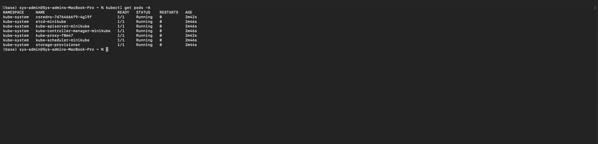
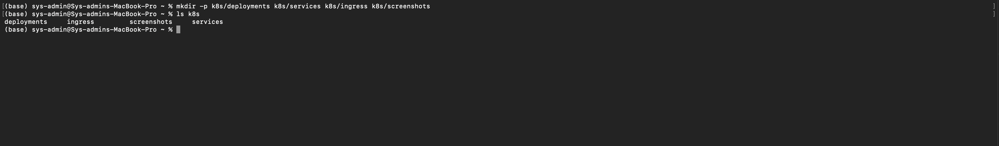
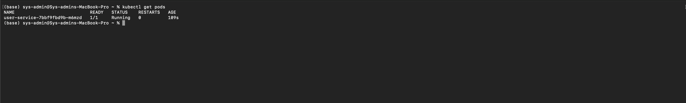
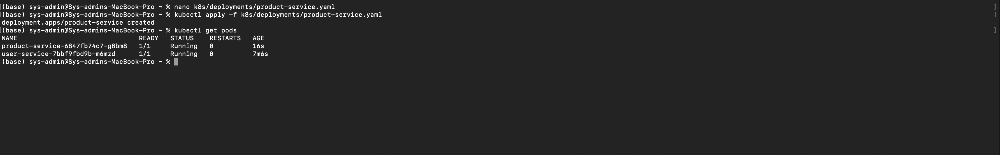
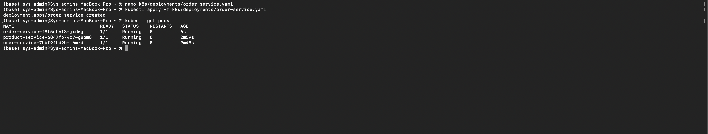
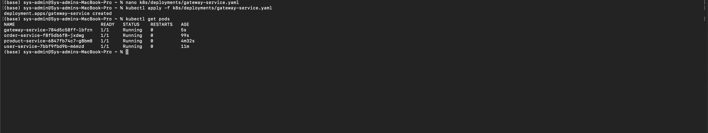
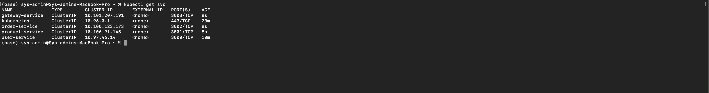
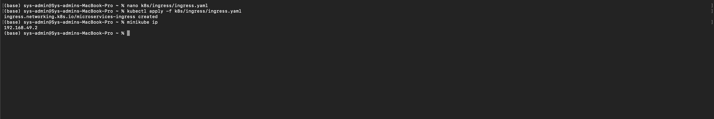

# Microservices Kubernetes Deployment using Minikube

## Objective

The objective of this project is to deploy a microservices-based application using Kubernetes and Minikube. The deployment demonstrates Kubernetes concepts such as Deployments, Services, Inter-Service Communication, Ingress Configuration, and validation testing.

---

# Technologies Used

- Kubernetes
- Minikube
- Docker Desktop
- kubectl
- NGINX Containers
- macOS Terminal

---

# Application Components

The application contains four microservices:

| Service Name | Description | Port |
|---|---|---|
| User Service | Handles user-related operations | 3000 |
| Product Service | Handles product-related operations | 3001 |
| Order Service | Handles order-related operations | 3002 |
| Gateway Service | API gateway and routing service | 3003 |

---

# Kubernetes Resources Implemented

## Deployments
Created Kubernetes Deployment manifests for:
- User Service
- Product Service
- Order Service
- Gateway Service

Each deployment includes:
- Labels and selectors
- Resource requests and limits
- Environment variables
- Readiness probes
- Liveness probes

---

## Services
Created Kubernetes ClusterIP Services for:
- User Service
- Product Service
- Order Service
- Gateway Service

The services enable:
- Internal cluster communication
- Kubernetes DNS-based service discovery
- Pod-to-pod communication

---

## Ingress Configuration
Implemented Kubernetes Ingress with path-based routing.

| Path | Routed Service |
|---|---|
| /api/users | User Service |
| /api/products | Product Service |
| /api/orders | Order Service |
| / | Gateway Service |

Ingress controller was enabled using Minikube addons.

---

# Project Folder Structure

```text
submission/
├── deployments/
│   ├── gateway-service.yaml
│   ├── order-service.yaml
│   ├── product-service.yaml
│   └── user-service.yaml
├── services/
│   ├── gateway-service.yaml
│   ├── order-service.yaml
│   ├── product-service.yaml
│   └── user-service.yaml
├── ingress/
│   └── ingress.yaml
├── screenshots/
│   ├── 01_docker_running.png
│   ├── 02_minikube_start.png
│   ├── 03_kubectl_nodes.png
│   ├── 04_pods_all_namespaces.png
│   ├── 05_project_structure.png
│   ├── 06_user_service_pods.png
│   ├── 07_services_list.png
│   ├── 08_product_service_pods.png
│   ├── 09_order_service_pods.png
│   ├── 10_gateway_service_pods.png
│   ├── 11_services_all.png
│   ├── 12_service_communication.png
│   ├── 13_ingress_controller.png
│   ├── 14_ingress_test.png
│   └── 15_final_service_test.png
└── README.md

---

# Screenshots

## 1. Docker Running


---

## 2. Minikube Cluster Startup


---

## 3. Kubernetes Nodes Verification


---

## 4. Pods Running in All Namespaces



---

## 5. Project Folder Structure



---

## 6. User Service Deployment



---

## 7. Services Creation


---

## 8. Product Service Deployment



---

## 9. Order Service Deployment



---

## 10. Gateway Service Deployment



---

## 11. All Kubernetes Services



---

## 12. Inter-Service Communication


---

## 13. Ingress Controller Verification


---

## 14. Ingress Configuration Test



---

## 15. Final Service Validation


---

# Conclusion

Successfully deployed and validated a Kubernetes-based microservices architecture using Minikube demonstrating:
- Kubernetes Deployments
- Kubernetes Services
- Cluster Networking
- Service Discovery
- Inter-Service Communication
- Ingress Configuration
- External Service Validation
